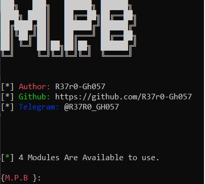
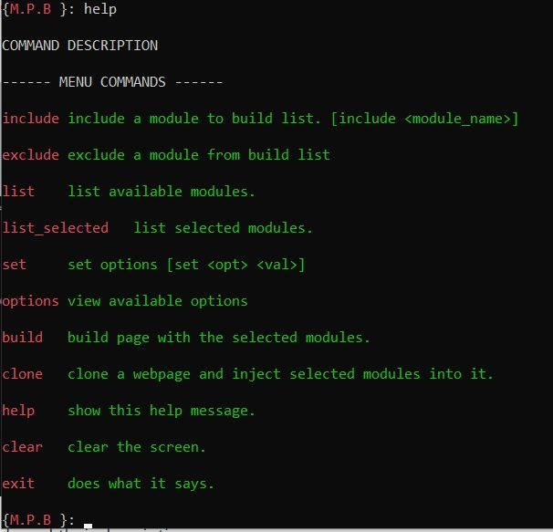

# Malicious Page Builder
## About
Malicious Page Builder is a tool which can generate a basic phishing page by using custom web templates that uses [HTML5 Web APIs](https://developer.mozilla.org/en-US/docs/Web/API).

## Installation & Run

`python3 -m pip install -r requirements.txt`

`python3 main.py`

type `help` to get a list of commands and their description.

## Contributing

[go here for contributing instructions](https://github.com/R37r0-Gh057/Malicious_Page_Builder/blob/main/CONTRIBUTING.MD)
